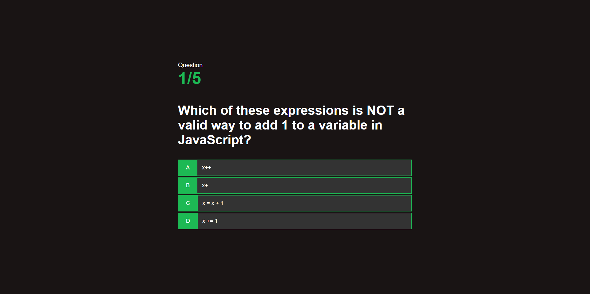

## About the Quiz
This is a simple quiz app with 5 programming-related questions. Users can score up to 50 points, with each correct answer awarding +10 points. The quiz tests basic programming knowledge and provides instant feedback on the user's score.

## Main Idea
The goal of this project was to experiment with building a functional quiz app using HTML, CSS, and JavaScript. It serves as a learning experience to explore new techniques and improve development skills.

## Features

• **Questions**: 5 questions related to programming.  
• **Score system**: Users earn 10 points per correct answer, with a maximum possible score of 50 points.  
• **Feedback**: Instant feedback on user progress.  
• **Local storage**: Latest user score is saved in the local storage.

## How you could Improve this Project
  
- [ ] \(**Highscores Display**): Add a feature to display all of the highscores from a database or use local storage to track users' previous attempts and scores.
- [ ] \(**API Fetching**): Enhance the app by integrating a suitable API to fetch random questions dynamically.
 
## Technologies Used

**HTML**: For structuring the quiz page.  
**CSS**: For styling the user interface.  
**JavaScript**: For logic and interactivity.  

## Live preview

You can check out the live version of the quiz [here](https://termjs.github.io/quiz-app-webpage/).
